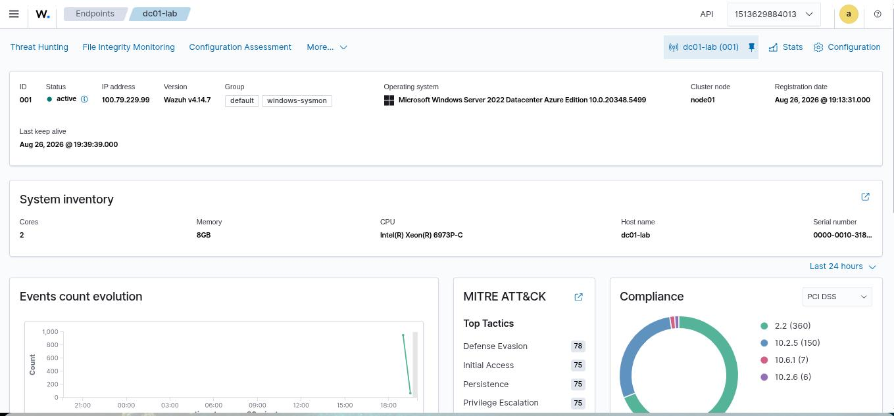

# Azure Windows Server Security Lab

> **Status: Deployed.** This Terraform + PowerShell has been run against a real Azure subscription: a Windows Server 2022 VM was provisioned, promoted to an Active Directory Domain Controller (`lab.local`), and hardened per the baseline below. See [`Evidence/`](./Evidence/) for the deployment proof (`Get-ADDomain` output, applied audit policy, and the full Azure resource list for the resource group).

## What this is

Terraform that provisions a single Windows Server 2022 VM in Azure, sized and locked down for a personal security lab (not production), plus PowerShell to promote it to an Active Directory Domain Controller and apply a baseline hardening/audit-policy configuration.

It's designed to pair with [`Active-Directory/Detection-Lab`](../../Active-Directory/Detection-Lab/README.md): that lab's `ad_security_event_analyzer.py` was originally validated against synthetic Windows Security event data only. `Scripts/Export-SecurityEventLog.ps1` closes that gap — it reads the real Security event log on this VM and reshapes it into the same JSON schema the analyzer expects, so the same detection logic now runs against real telemetry. See [Real telemetry results](#real-telemetry-results) below for the actual output.

## Architecture

```
                         Internet
                            │
                 (RDP/3389, admin IP only)
                            │
                      ┌─────▼─────┐
                      │    NSG    │  default-deny inbound,
                      │           │  one allow rule scoped to
                      └─────┬─────┘  admin_source_ip/32
                            │
                    ┌───────▼────────┐
                    │  Subnet         │  10.20.0.0/26
                    │  10.20.0.0/24   │
                    │  ┌───────────┐  │
                    │  │  Windows  │  │  Standard_B2s
                    │  │  Server   │  │  auto-shutdown daily
                    │  │  2022 VM  │  │
                    │  └───────────┘  │
                    └─────────────────┘
```

## Security design choices

- **RDP is never open to the internet.** `admin_source_ip` has no default in `variables.tf` — Terraform will refuse to apply without it, and the value is validated as a real CIDR block. The NSG's only inbound allow rule is scoped to that address; everything else is an explicit deny.
- **No secrets in git.** `admin_password` has no default either. Real values go in a local `terraform.tfvars` (gitignored) — `terraform.tfvars.example` shows the shape without real values.
- **Auto-shutdown.** The VM stops itself daily (`auto_shutdown_time`, default 19:00 UTC) so a forgotten lab doesn't run up an Azure bill.
- **Small SKU by default.** `Standard_B2s` is enough to run a lab DC; it's not sized for production AD.

## Prerequisites

- An Azure subscription and the [Azure CLI](https://learn.microsoft.com/cli/azure/install-azure-cli), authenticated (`az login`)
- [Terraform](https://developer.hashicorp.com/terraform/install) >= 1.5
- Your current public IP (e.g. from `https://ifconfig.me`) for `admin_source_ip`

## Deploying

```bash
cd Terraform
cp terraform.tfvars.example terraform.tfvars
# edit terraform.tfvars: set admin_password and admin_source_ip

terraform init
terraform plan
terraform apply
```

Once applied, RDP to the `public_ip_address` output using the `admin_username`/`admin_password` you set.

## Post-deployment configuration

On the VM itself (via RDP, or `az vm run-command invoke`):

```powershell
# 1. Promote to a Domain Controller
.\Configure-DomainController.ps1 -DomainName "lab.local"
# VM reboots automatically to finish promotion.

# 2. After it comes back up, apply the security/audit baseline
.\Harden-WindowsServer.ps1

# 3. Export real Security event log data for the AD Detection Lab
.\Export-SecurityEventLog.ps1

# 4. Install Sysmon (SwiftOnSecurity config) and export telemetry for the
#    Windows/Sysmon Endpoint Detection Lab
.\Install-Sysmon.ps1
.\Export-SysmonEvents.ps1

# 5. Install Tailscale (interactive: `tailscale up` needs a browser login)
#    and connect this VM to the same private network as the Wazuh Manager,
#    then install the Wazuh Agent pointed at the Manager's Tailscale IP
.\Install-WazuhAgent.ps1 -WazuhManager "<manager-tailscale-ip>" -WazuhVersion "4.14.7-1"
```

## Tearing down

```bash
cd Terraform
terraform destroy
```

Do this when you're done for the day — the auto-shutdown schedule stops billing for compute overnight, but storage and the public IP keep incurring small charges until the resource group is actually destroyed.

## Cost awareness

Standard_B2s in most regions runs roughly $0.04–0.05/hr; with the daily auto-shutdown a lab used a few hours a day costs a few dollars a month. `terraform destroy` when not actively using it removes the risk entirely.

## Evidence

- [`Evidence/get-addomain-verification.jpg`](./Evidence/get-addomain-verification.jpg) — `Get-ADDomain` output on the deployed VM, confirming the forest (`lab.local`), NetBIOS name (`LAB`), and domain controller (`dc01-lab.lab.local`).
- [`Evidence/hardening-baseline-applied.jpg`](./Evidence/hardening-baseline-applied.jpg) — `Harden-WindowsServer.ps1` output confirming the audit policy (Logon/Logoff, Account Management, Kerberos) is active.
- [`Evidence/azure-resource-list.txt`](./Evidence/azure-resource-list.txt) — full `az resource list` output for the resource group, confirming every Terraform-managed resource (including the auto-shutdown schedule) deployed successfully.
- [`Evidence/raw-security-events.json`](./Evidence/raw-security-events.json) — 409 real Windows Security events exported from this VM via `Export-SecurityEventLog.ps1`.
- [`Evidence/real-ad-analysis.json`](./Evidence/real-ad-analysis.json) — output of `ad_security_event_analyzer.py` run against that real data (392 findings: 1 CRITICAL, 16 HIGH, 375 MEDIUM).
- [`Evidence/raw-sysmon-events.json`](./Evidence/raw-sysmon-events.json) — 16 real Sysmon (Process Create, Network Connect) and Security (failed logon) events exported from this VM via `Export-SysmonEvents.ps1`, after installing Sysmon with the SwiftOnSecurity community configuration.
- [`Evidence/real-sysmon-analysis.json`](./Evidence/real-sysmon-analysis.json) — output of the [Windows/Sysmon Endpoint Detection Lab](../../Endpoint-Security/Windows-Sysmon-Detection-Lab/README.md)'s `real_endpoint_event_analyzer.py` run against that real data (5 findings, all medium).
- [`Evidence/wazuh-agent-connection.txt`](./Evidence/wazuh-agent-connection.txt) — this VM's Wazuh Agent connected to the home lab's Wazuh Manager over a Tailscale mesh VPN: Manager-side `agent_control` confirmation, agent connection log, a real MITRE-mapped alert, and CIS Benchmark SCA findings generated by Wazuh's own rule engine.
- [`Evidence/wazuh-dashboard-agent-active.jpg`](./Evidence/wazuh-dashboard-agent-active.jpg) — Wazuh Dashboard's endpoint view for `dc01-lab`: status Active, both `default`/`windows-sysmon` groups, a real MITRE ATT&CK tactic breakdown, and a live events graph.

## Real telemetry results

Running [`Active-Directory/Detection-Lab/Scripts/ad_security_event_analyzer.py`](../../Active-Directory/Detection-Lab/Scripts/ad_security_event_analyzer.py) against `Evidence/raw-security-events.json` (409 real events from this VM) produced 392 findings. Reading them honestly, in the way a SOC analyst has to:

- **375 MEDIUM "Special Privileges Assigned to New Logon"** — almost entirely `SYSTEM`, `dc01-lab$` (the machine account), `NETWORK SERVICE`, and normal interactive logons. This is Windows background/service noise, not attacker activity — recognizing it as baseline rather than escalating every one is the actual skill being demonstrated here.
- **16 HIGH "Privileged Group Membership Change"** — `Domain Admins`, `krbtgt`, `Cert Publishers`, `Domain Controllers`, `Group Policy Creator Owners`, and the admin account. All explained by the AD DS forest-promotion process itself, which populates these groups automatically — not an intrusion.
- **1 CRITICAL "Security Audit Log Cleared"** — most likely triggered by the audit policy changes `Harden-WindowsServer.ps1` made, or the DC promotion process, not a cover-up.

This is deliberately left as real, unfiltered output rather than a cherry-picked "clean" result — a raw event-based analyzer with no baselining will always flag legitimate administrative activity like this, and correctly interpreting that (rather than either ignoring it or panicking) is the point of the exercise.

## Real Sysmon telemetry results

Sysmon was installed on this VM with the [SwiftOnSecurity](https://github.com/SwiftOnSecurity/sysmon-config) community configuration (Sysmon's default settings log almost nothing useful). `Export-SysmonEvents.ps1` then captured Process Create (ID 1), Network Connect (ID 3), and failed-logon (Security ID 4625) events, and [`Endpoint-Security/Windows-Sysmon-Detection-Lab`](../../Endpoint-Security/Windows-Sysmon-Detection-Lab/README.md)'s `real_endpoint_event_analyzer.py` ran the same detection logic used against synthetic data over this real capture.

16 events analyzed, 5 findings (0 high, 5 medium):

- **EDR-004 ×1** — `notepad.exe` spawned by `powershell.exe`: a deliberate test launch during the session.
- **EDR-002 ×3** — `powershell.exe` connecting outbound on port 443: the session's own `Invoke-WebRequest` calls downloading Sysmon and its config from Sysinternals/GitHub.
- **EDR-003 ×1** — the same single failed logon already present in the AD Detection Lab's real data.

No genuinely malicious activity is present — every finding traces back to real, explainable actions taken on the box during this deployment, which is exactly the kind of result an unfiltered detector should produce on a clean lab VM.

## Real Wazuh Agent connection

This VM's Wazuh Agent is connected to the project's Wazuh Manager
([`SIEM/Wazuh`](../../SIEM/Wazuh)), which runs locally via Docker on a home
machine. Rather than exposing the Manager's ports on the home network, both
machines join a private [Tailscale](https://tailscale.com) mesh VPN
(WireGuard-based, no inbound port opened at home), with a Tailscale ACL
rule scoping the VM's access to exactly the Manager's agent ports
(1514/1515).

```
Azure VM (dc01-lab, 100.79.229.99)
        |  Tailscale mesh VPN (WireGuard, encrypted)
        v
Home Wazuh Manager (100.104.119.57, Docker)
```

Verified from the Manager's own CLI:

```
$ docker exec single-node-wazuh.manager-1 /var/ossec/bin/agent_control -lc
   ID: 001, Name: dc01-lab, IP: any, Active
```

Once connected, Wazuh's own rule engine (not this repo's custom analyzers)
generated real alerts from the agent's telemetry, including a MITRE-mapped
authentication event (`60106 - Windows Logon Success` → **T1078 Valid
Accounts**) and genuine Security Configuration Assessment findings against
the real CIS Microsoft Windows Server 2022 Benchmark. Full text evidence is
in [`Evidence/wazuh-agent-connection.txt`](./Evidence/wazuh-agent-connection.txt),
and a dashboard screenshot confirming the endpoint's live status is in
[`Evidence/wazuh-dashboard-agent-active.jpg`](./Evidence/wazuh-dashboard-agent-active.jpg).
The agent was also moved into the Manager's pre-existing `windows-sysmon`
group to pick up its Windows Security/Sysmon/PowerShell/Windows Defender
collection config.



This closes what had been the portfolio's last explicitly-deferred gap
(Wazuh Agent → Manager connectivity) — see
[`SIEM/Wazuh/Reports/Wazuh-Live-Server-Integration.md`](../../SIEM/Wazuh/Reports/Wazuh-Live-Server-Integration.md)
for the Manager-side write-up.

## Notes on Azure Cloud Shell

Deployment was driven from Azure Cloud Shell. Two things worth knowing if you repeat this:

- **Region/SKU capacity restrictions.** `Standard_B2s` and `Standard_D2s_v3` both hit `SkuNotAvailable` on this subscription in `eastus`/`eastus2`. Run `az vm list-skus --location <region> --resource-type virtualMachines --all false --output table` first and pick a size with `Restrictions: None` rather than guessing — `Standard_D2s_v7` worked here.
- **Cloud Shell's `$HOME` is not guaranteed to persist across sessions**, which means Terraform's local `.tfstate` file can be lost between sessions even though the real Azure resources keep running. If a session starts fresh and `terraform apply` prompts for variables it should already have, do **not** proceed — that's a sign state is gone and re-applying would try to recreate everything from scratch. Verify what's actually running with `az resource list --resource-group rg-winserver-security-lab --output table` instead, and only re-run Terraform once state is reconciled (or manage teardown directly via `az group delete`).
- **`az vm run-command invoke` output is capped around 4KB and gets unreliable under repeated rapid calls** — for `Export-SecurityEventLog.ps1`'s 409-event output, pulling it back through `run-command`'s response (even chunked) hit truncation and stale/cached-result issues. What worked: have the VM push the file directly to GitHub via the Contents API (`Invoke-RestMethod` with a token, from inside a single `run-command` call) rather than trying to relay large data back through the command's own output channel.
- **No `winget` on Windows Server 2022** — it needs the App Installer package, which isn't present on this server image. Downloading installers directly with `Invoke-WebRequest` works for some vendors (Sysmon, the Wazuh Agent MSI) but not all; Tailscale's MSI URL 404'd, so its installer had to be downloaded via a browser in the RDP session instead.
- **Tailscale requires an interactive first-time login** (`tailscale up` prints a URL to authenticate in a browser) — this cannot be scripted headlessly without a pre-issued auth key, so it's a manual, one-time step per machine.
- **A tailnet's Access Control List is default-deny once any rule exists.** Adding one ACL rule for an unrelated purpose (this home tailnet already had a rule scoping a tagged RustDesk server) silently blocks every other cross-device connection unless a matching rule is added — `tailscale status` on the side missing visibility simply won't list the other device as a peer, which looks like a connectivity bug but is actually a policy gap.
