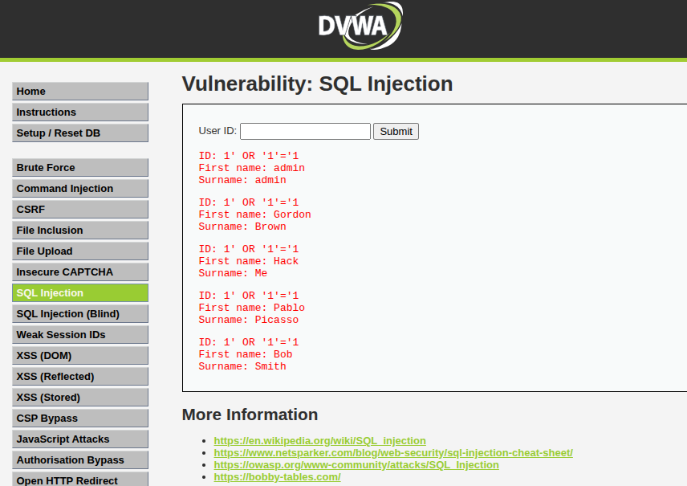

# Objective

The objective of this laboratory assessment was to identify, reproduce, document and assess common web application security vulnerabilities in Damn Vulnerable Web Application (DVWA). The assessment focused on understanding attack behavior, collecting supporting evidence, evaluating security impact, and documenting documented remediation actions and validation considerations.

# DVWA Vulnerability Assessment Report

## Target

Damn Vulnerable Web Application (DVWA)

## Assessment Type

Web Application Security Testing

## Testing Environment

Local Security Laboratory

---

# Executive Summary

A vulnerability assessment was performed against DVWA to identify common web application security weaknesses.

The assessment focused on OWASP Top 10 vulnerabilities.

---

# Tools Used

- DVWA
- Burp Suite
- Browser Developer Tools
- OWASP Testing Methodology

---

# Vulnerabilities Identified

## 1. SQL Injection

Severity:

High

Description:

The application accepted unsanitized user input allowing SQL queries to be manipulated.

Impact:

- Database exposure
- Unauthorized data access

Recommendation:

- Use parameterized queries
- Validate user input
- Implement secure coding practices

---

## 2. Cross-Site Scripting (XSS)

Severity:

Medium

Description:

User input was reflected without proper sanitization.

Impact:

- Session theft
- Malicious script execution

Recommendation:

- Output encoding
- Input validation

---

# Security Lessons

This lab demonstrated:

- Importance of secure development
- OWASP vulnerability testing
- Web application risk assessment
---

# Evidence

Screenshots:

- SQL Injection successful execution
- Vulnerable input field
- Application response

Example:

---

# Risk Rating

CVSS Estimate:

SQL Injection:
8.8 High

XSS:
6.1 Medium

---

# Remediation Verification

After applying security controls:

- Validate input filtering
- Test again
- Confirm vulnerability closure

## Skills & Tools

Document the actual security domains and tools used in this lab.

> **VERIFICATION REQUIRED:** Add exact technical details only when supported by the existing lab evidence.

## Architecture

Describe the actual laboratory architecture using only verified information.

> **VERIFICATION REQUIRED:** Add exact technical details only when supported by the existing lab evidence.

## Topology

Document the actual traffic/data flow between assessment host, target and monitoring components.

> **VERIFICATION REQUIRED:** Add exact technical details only when supported by the existing lab evidence.

## Walkthrough

Provide a chronological analyst walkthrough from preparation through evidence collection.

> **VERIFICATION REQUIRED:** Add exact technical details only when supported by the existing lab evidence.

## Attack Simulation

Document the controlled security activity actually performed.

> **VERIFICATION REQUIRED:** Add exact technical details only when supported by the existing lab evidence.

## Detection

Explain what observable event, response, alert or traffic indicated the security condition.

> **VERIFICATION REQUIRED:** Add exact technical details only when supported by the existing lab evidence.

## Triage

Explain initial validation, scope assessment and severity determination.

> **VERIFICATION REQUIRED:** Add exact technical details only when supported by the existing lab evidence.

## Investigation

Explain how evidence was correlated and analysed.

> **VERIFICATION REQUIRED:** Add exact technical details only when supported by the existing lab evidence.

## Root Cause

Identify the underlying weakness or configuration responsible.

> **VERIFICATION REQUIRED:** Add exact technical details only when supported by the existing lab evidence.

## MITRE ATT&CK

Map only techniques directly supported by the observed activity.

> **VERIFICATION REQUIRED:** Add exact technical details only when supported by the existing lab evidence.

## Lessons Learned

Summarise practical security and analyst lessons.

> **VERIFICATION REQUIRED:** Add exact technical details only when supported by the existing lab evidence.

## Recommendations

Provide actionable controls and monitoring improvements.

> **VERIFICATION REQUIRED:** Add exact technical details only when supported by the existing lab evidence.

## Evidence Verification

Before publication, verify all technical claims against the repository evidence:

- IP addresses
- Hostnames
- Ports
- Event IDs
- Alert levels
- Payloads
- Vulnerability identifiers
- Packet characteristics
- MITRE ATT&CK mappings
- Remediation results
- Validation/retest results

Unsupported details must not be presented as observed findings.

## SOC Documentation Upgrade

This draft was generated from the existing repository evidence. Existing technical content was preserved. Unsupported technical details are explicitly marked for verification.

<!-- FINAL-CORRECTION-DVWA-2026 -->
## Execution

Testing was performed against the controlled DVWA laboratory environment using the documented vulnerable application functionality. Tests were conducted against the application rather than an external production system.

The assessment used the existing DVWA test cases and supporting screenshots contained in the repository.

## Findings

The assessment identified multiple intentionally vulnerable application behaviours. Detailed vulnerability-specific evidence is maintained in the supporting DVWA reports covering areas such as brute force, command injection, CSRF, file inclusion, file upload, SQL injection, weak session handling and XSS.

## Impact

Successful exploitation of the identified weaknesses could allow an attacker to access information, manipulate application behaviour, execute unintended commands or compromise application functionality depending on the vulnerability and available privileges.

Because DVWA is intentionally vulnerable, these findings demonstrate security weaknesses rather than evidence of compromise of a production environment.

## Validation

Validation should consist of repeating the original proof-of-concept after remediation and confirming that the vulnerable behaviour can no longer be reproduced.

Where a remediation retest was not actually performed in this laboratory, the validation status must remain **Requires Verification** rather than being reported as successfully remediated.
