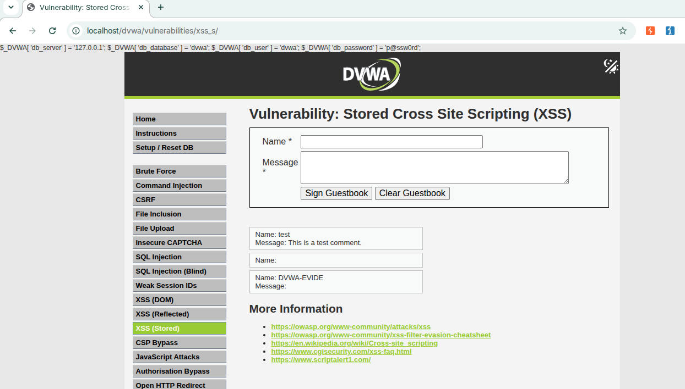
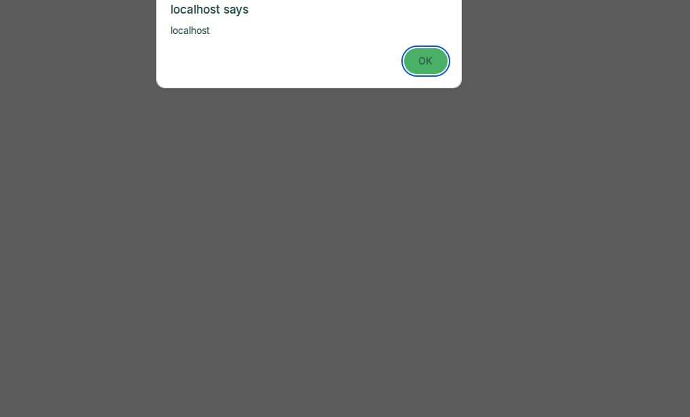

# DVWA XSS Assessment

## Objective

Document controlled Cross-Site Scripting testing performed against the local DVWA laboratory.

## Evidence Boundary

The screenshots in this report were captured from the local DVWA instance at `localhost`. They represent controlled laboratory activity and are not production evidence.

## Stored XSS

The stored-XSS screenshot shows the DVWA guestbook area after test content had been persisted.

## Reflected XSS

The reflected-XSS screenshot shows browser-side JavaScript execution through a localhost alert dialog.

## Security Impact

Successful XSS demonstrates that attacker-controlled input can reach a browser execution context. In a real application, impact depends on the execution context, victim interaction, cookie protections, CSP and available application privileges.

## Remediation

- Apply context-appropriate output encoding.
- Validate and constrain untrusted input.
- Implement a restrictive Content Security Policy where appropriate.
- Use secure cookie attributes.
- Avoid unsafe DOM insertion APIs.
- Retest after remediation.

## Evidence Classification

**Controlled laboratory evidence.**
