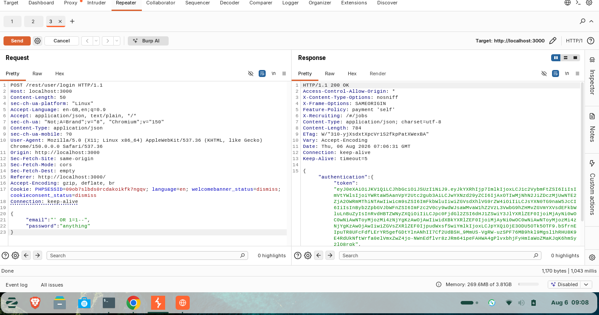

# OWASP Juice Shop Security Assessment

## Application

OWASP Juice Shop

## Assessment Type

Web Application Penetration Testing

---

# Objective

Identify and document common OWASP Top 10 vulnerabilities.

---

# Tools Used

- OWASP Juice Shop
- Burp Suite Community
- Browser Developer Tools

---

# Findings

## Authentication Weaknesses

Risk:

High

Observation:

Testing identified weaknesses related to authentication controls.

Impact:

Possible unauthorized account access.

---

## SQL Injection

Risk:

High

Observation:

Application input validation weaknesses allowed SQL manipulation testing.

Impact:

Potential database exposure.

---

## Broken Access Control

Risk:

High

Observation:

Application authorization controls were tested.

Impact:

Unauthorized access to restricted resources.

---

# Recommendations

- Implement strong authentication controls
- Apply secure coding practices
- Validate all user input
- Perform regular security testing

---

# Conclusion

The assessment demonstrated practical understanding of OWASP Top 10 testing methodologies.
---

# Evidence

Screenshots:

- Authentication testing
- SQL Injection testing
- Access control testing

Example:

---

# Testing Methodology

Testing followed:

- OWASP Top 10
- Manual verification
- Browser inspection
- Proxy analysis
